# RAG Chatbot Implementation Plan

## Atomic Habits AI Partner for Track N' Stick

---

## Executive Summary

This document outlines the implementation of an AI-powered chatbot for the Track
N' Stick habit-tracking app. The chatbot will serve as a virtual habit coach,
answering user questions exclusively using knowledge from **"Atomic Habits"** by
James Clear.

**Key Deliverables:**

- RAG (Retrieval Augmented Generation) pipeline using Pinecone vector database
- Streaming chat API endpoint on Cloudflare Workers
- React chat interface with real-time responses
- PDF ingestion pipeline for Atomic Habits content

---

## 1. Problem Statement

### The Need

Users of habit-tracking apps often struggle with:

- Understanding _how_ to build effective habits
- Staying motivated when habits break
- Knowing which strategies work best for their situation

### The Solution

An AI chatbot grounded in proven behavioral science from Atomic Habits provides:

- Instant access to expert habit-building knowledge
- Contextual advice based on user questions
- A consistent, always-available coaching experience

### Why Build Our Own (vs. Using ChatGPT/Claude)?

| Reason                   | Explanation                                              |
| ------------------------ | -------------------------------------------------------- |
| **Knowledge Control**    | Answers ONLY from Atomic Habits—no hallucinated advice   |
| **Learning Opportunity** | Hands-on experience with RAG, embeddings, and vector DBs |
| **Cost Control**         | Pay per query, not per seat; scale predictably           |
| **Customization**        | Tailor personality, response length, and focus areas     |

---

## 2. Architecture Overview

### High-Level Flow


### The RAG Pattern Explained

**RAG (Retrieval Augmented Generation)** solves a key LLM limitation: language
models only know their training data. By retrieving relevant context at query
time, we can:

1. **Ground responses in source material** → No hallucinations
2. **Use smaller, faster models** → The context does the heavy lifting
3. **Update knowledge without retraining** → Just update the vector database

**Our RAG Flow:**

```mermaid
User Question → Embed → Search Pinecone → Get Book Chunks → Inject into Prompt → LLM Generates Answer
```

---

## 3. Technology Decisions

### Vector Database: Pinecone

**Why Pinecone over alternatives?**

| Option               | Pros                           | Cons                      | Verdict        |
| -------------------- | ------------------------------ | ------------------------- | -------------- |
| **Pinecone**         | Managed, fast, proven at scale | External API call         | ✅ Chosen      |
| Cloudflare Vectorize | Native to Workers              | Newer, less battle-tested | Considered     |
| Qdrant               | Self-hosted control            | Ops overhead              | Not chosen     |
| pgvector             | Uses existing Postgres         | D1 doesn't support it     | Not applicable |

**Pinecone Benefits:**

- Zero infrastructure management
- Millisecond query latency
- Free tier sufficient for this use case (~100K vectors)
- Excellent TypeScript SDK

---

### LLM: Cloudflare Workers AI (Llama 3.1 8B)

**Why Workers AI over OpenAI/Anthropic?**

| Factor       | Workers AI                   | OpenAI GPT-4o-mini    |
| ------------ | ---------------------------- | --------------------- |
| **Latency**  | Native to Workers (fast)     | External API (+100ms) |
| **API Keys** | None needed                  | Required              |
| **Cost**     | Included in Workers plan     | Per-token billing     |
| **Quality**  | Good for RAG (context helps) | Marginally better     |

**Why Llama 3.1 8B specifically?**

- **8B parameters**: Sweet spot of speed vs. quality
- **Instruction-tuned**: Follows prompts well
- **Streaming support**: Real-time responses
- **Meta's latest**: Strong reasoning capabilities

---

### Embeddings: BGE Base EN v1.5

**Why this model?**

| Factor                   | Value                                          |
| ------------------------ | ---------------------------------------------- |
| **Dimensions**           | 768 (good semantic capture, efficient storage) |
| **Benchmark Rank**       | Top 10 on MTEB leaderboard                     |
| **Optimized For**        | Retrieval tasks (exactly our use case)         |
| **Native to Workers AI** | No external calls needed                       |

---

### AI SDK: Vercel AI SDK

**Why use an SDK instead of raw API calls?**

| Without SDK                | With AI SDK              |
| -------------------------- | ------------------------ |
| Manual SSE parsing         | `toTextStreamResponse()` |
| Custom state management    | `useChat()` hook         |
| Provider-specific code     | Unified interface        |
| Error handling boilerplate | Built-in error states    |

**Specific benefits in our stack:**

```typescript
// Without AI SDK (complex)
const response = await ai.run('@cf/meta/llama-3.1-8b-instruct', { ... });
for await (const chunk of response) { /* manual stream handling */ }

// With AI SDK (clean)
const result = streamText({
  model: workersai('@cf/meta/llama-3.1-8b-instruct'),
  messages: [...],
});
return result.toTextStreamResponse();
```

---

## 4. Implementation Approach

### Phase 1: Content Ingestion (One-Time Setup)

**Goal:** Convert Atomic Habits PDF into searchable vector embeddings.


**Why chunk at ~500 characters?**

- Too small → Loses context
- Too large → Dilutes semantic meaning
- 500 chars ≈ 2-3 paragraphs → Optimal retrieval unit

**Why overlap chunks?**

- Prevents losing context at chunk boundaries
- 50-char overlap ensures continuity

---

### Phase 2: Backend API

**Endpoint:** `POST /api/v1/chat`

**Request Flow:**

1. Receive user messages
2. Extract latest user query
3. Generate embedding for query
4. Search Pinecone for top 5 relevant chunks
5. Inject chunks into system prompt
6. Stream LLM response back to client

**Why top 5 chunks?**

- Provides sufficient context without overwhelming the prompt
- Balances relevance vs. speed
- Keeps token count manageable

---

### Phase 3: Frontend Chat UI

**UI Pattern: Floating Chat Widget**

The chatbot will be implemented as a **floating widget** that appears on all
pages:

- **Collapsed State:** A circular icon fixed to the bottom-right corner of the
  viewport
- **Expanded State:** When clicked, a chatbox opens above the icon
- **Always Available:** Accessible from any page in the app without navigation

```mermaid
flowchart TB
    subgraph Collapsed
        A[🤖 Circular Icon]
    end

    subgraph Expanded
        B[Chat Header with Close Button]
        C[Message List]
        D[Input Field]
        E[🤖 Circular Icon Active]
    end

    A -->|Click| Expanded
    E -->|Click| Collapsed
```



**Component Structure:**

```typescript
Layout (wraps all pages)
└── ChatWidget (fixed position, bottom-right)
    ├── ChatToggle (circular button to open/close)
    └── ChatBox (conditionally rendered when open)
        ├── ChatHeader (title + close button)
        ├── ChatMessages (scrollable message list)
        │   └── ChatMessage (individual message bubble)
        └── ChatInput (text input + send button)
```

**Why useChat hook?**

- Automatic optimistic updates
- Built-in loading states
- Handles SSE stream parsing
- Error state management

**Why Floating Widget vs. Dedicated Route?**

| Aspect             | Floating Widget            | Dedicated Route       |
| ------------------ | -------------------------- | --------------------- |
| **Accessibility**  | Available on all pages     | Requires navigation   |
| **Context**        | User stays in current flow | Loses current context |
| **UX Pattern**     | Familiar (Intercom, Drift) | Less discoverable     |
| **Implementation** | Slightly more complex      | Simpler routing       |

---

## 5. File Structure

### Backend (tracknstick-api)

```typescript
src/
├── routes/
│   └── chat.ts              # Route definition
├── controllers/
│   └── chat.controller.ts   # Request handling, streaming
├── services/
│   └── chat.service.ts      # RAG logic (embed, search, prompt)
scripts/
├── ingest-atomic-habits.ts  # PDF → chunks
└── generate-embeddings.ts   # Chunks → Pinecone
```

### Frontend (tracknstick.com)

```typescript
src/
├── components/
│   └── layout/
│       └── layout.tsx           # Wraps all pages, includes ChatWidget
├── features/
│   └── chat/
│       └── components/
│           ├── ChatWidget.tsx    # Floating container (fixed position)
│           ├── ChatToggle.tsx    # Circular button to open/close
│           ├── ChatBox.tsx       # Chat panel (header + messages + input)
│           ├── ChatHeader.tsx    # Title bar with close button
│           ├── ChatMessages.tsx  # Scrollable message list
│           ├── ChatMessage.tsx   # Individual message bubble
│           └── ChatInput.tsx     # Text input and send button
```

**Integration Point:**

The `ChatWidget` component is rendered inside the main `Layout` component,
making it available across all pages without modifying individual page
components.

---

## 6. Dependencies

### Backend

```bash
# Runtime
pnpm add ai @ai-sdk/cloudflare @pinecone-database/pinecone

# Development (for ingestion scripts)
pnpm add -D unpdf tsx
```

### Frontend

```bash
pnpm add ai @ai-sdk/react
```

---

## 7. Execution Steps

### Step 1: Pinecone Setup

1. Create account at pinecone.io
2. Create index: `atomic-habits`, 768 dimensions, cosine metric
3. Copy API key

### Step 2: Content Ingestion

```bash
cd tracknstick-api
pnpm add -D unpdf tsx
mkdir -p data

# Parse PDF
npx tsx scripts/ingest-atomic-habits.ts /path/to/atomic-habits.pdf

# Generate embeddings and upload to Pinecone
# Create a .env file for secrets
# CLOUDFLARE_ACCOUNT_ID=xxx
# CLOUDFLARE_API_TOKEN=xxx
# PINECONE_API_KEY=xxx

# Source the .env file
source .env && npx tsx scripts/generate-embeddings.ts
```

### Step 3: Backend Implementation

1. Add dependencies:
   `pnpm add ai @ai-sdk/cloudflare @pinecone-database/pinecone`
2. Create route, controller, service files
3. Set secret: `wrangler secret put PINECONE_API_KEY`
4. Deploy: `wrangler deploy`

### Step 4: Frontend Implementation

1. Add dependencies: `pnpm add ai @ai-sdk/react`
2. Create Chat components (`ChatWidget`, `ChatToggle`, `ChatBox`, etc.)
3. Integrate `ChatWidget` into the main `Layout` component
4. Test locally: `pnpm dev`

---

## 8. Testing Strategy

### Manual Test Cases

| Test                        | Expected Result                                     |
| --------------------------- | --------------------------------------------------- |
| "What are the Four Laws?"   | Cites Make it Obvious, Attractive, Easy, Satisfying |
| "How to break a bad habit?" | References inversion of the Four Laws               |
| "What stocks should I buy?" | Politely declines—off-topic                         |
| "Explain habit stacking"    | Describes linking new habits to existing ones       |
| **Edge Case**               | "..." (Empty/short input) -> Handle gracefully      |
| **Ambiguity**               | "How do I do it?" -> Ask for clarification          |

### Verification Checklist

- [ ] Streaming responses appear character-by-character
- [ ] Error states display correctly (Graceful degradation)
- [ ] Auth token passed correctly
- [ ] Mobile responsive
- [ ] Backend Integration Test (verify chunks retrieved)
- [ ] Performance check (response time acceptable)

---

## 9. Future Enhancements

| Feature                 | Description                        | Effort |
| ----------------------- | ---------------------------------- | ------ |
| **Chat History**        | Persist conversations per user     | Medium |
| **Suggested Questions** | Show starter prompts               | Low    |
| **Citations**           | Show which book section was used   | Medium |
| **Voice Input**         | Speech-to-text for questions       | High   |
| **Multiple Books**      | Add other habit/productivity books | Medium |

---

## 10. Summary

This implementation delivers a production-ready AI chatbot that:

- ✅ **Answers only from Atomic Habits** → No hallucinations
- ✅ **Streams responses in real-time** → Great UX
- ✅ **Uses modern AI SDK patterns** → Clean, maintainable code
- ✅ **Runs on Cloudflare edge** → Low latency globally
- ✅ **Scales cost-effectively** → Pay per query

The modular architecture allows future expansion to include chat history,
multiple knowledge sources, and additional features.
