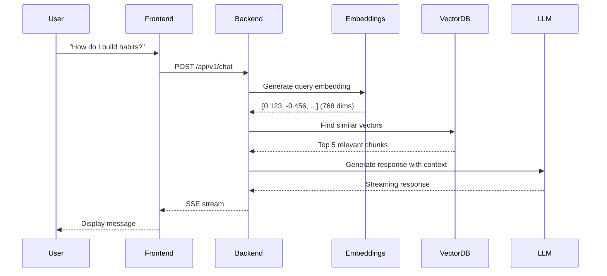
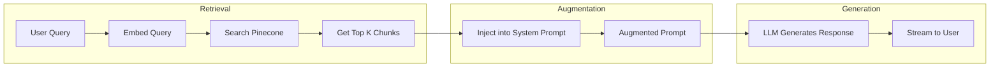
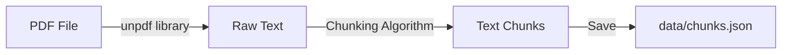
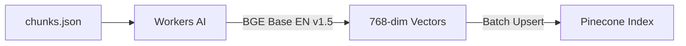
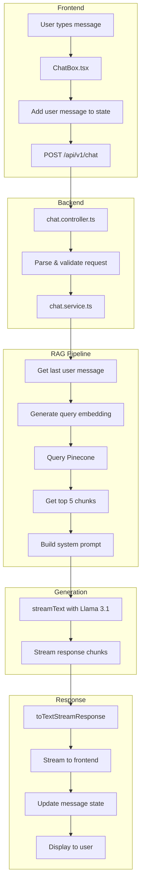

# RAG Chatbot Architecture

## Complete Technical Documentation

This document provides an in-depth explanation of the RAG (Retrieval Augmented
Generation) chatbot implementation for the Track N' Stick habit tracking
application.

---

## Table of Contents

1. [What is RAG?](#what-is-rag)
2. [Architecture Overview](#architecture-overview)
3. [Data Ingestion Pipeline](#data-ingestion-pipeline)
4. [Backend Implementation](#backend-implementation)
5. [Frontend Implementation](#frontend-implementation)
6. [Technology Stack](#technology-stack)
7. [Data Flow Diagram](#data-flow-diagram)
8. [File Structure](#file-structure)
9. [Security Considerations](#security-considerations)

---

## What is RAG?

**RAG (Retrieval Augmented Generation)** is a technique that enhances Large
Language Models (LLMs) by providing them with relevant context retrieved from an
external knowledge base at query time.

### The Problem RAG Solves

LLMs have a knowledge cutoff and can "hallucinate" (generate plausible but
incorrect information). RAG addresses this by:

1. **Grounding responses in source material** — The LLM can only reference
   information from your knowledge base
2. **Using smaller, faster models** — Context does the heavy lifting, so you
   don't need the largest models
3. **Updating knowledge without retraining** — Just update the vector database

### RAG vs Fine-Tuning

| Approach        | Use Case                            | Pros                                          | Cons                                  |
| --------------- | ----------------------------------- | --------------------------------------------- | ------------------------------------- |
| **RAG**         | Dynamic knowledge, specific domains | No training, easy updates, verifiable sources | Requires vector DB, retrieval latency |
| **Fine-Tuning** | Changing model behavior/style       | Faster inference, no retrieval                | Expensive, requires training data     |

Our implementation uses RAG because we want the chatbot to answer **only** from
"Atomic Habits" content, which can be verified and updated easily.

---

## Architecture Overview

### High-Level Flow



### The Three Stages of RAG



---

## Data Ingestion Pipeline

Before the chatbot can answer questions, we must process the source material
(Atomic Habits PDF) into searchable embeddings.

### Step 1: PDF Text Extraction

**Script:** `scripts/ingest-atomic-habits.ts`



**Chunking Strategy:**

- **Chunk Size:** ~500 characters
- **Overlap:** 50 characters between chunks
- **Boundary Detection:** Prioritizes sentence endings (`.`, `!`, `?`) then word
  boundaries

**Why these parameters?**

- Too small chunks lose context
- Too large chunks dilute semantic meaning
- Overlap prevents losing information at boundaries

**Example Output:**

```json
[
  "The most effective way to change your habits is to focus not on what you want to achieve, but on who you wish to become. Your identity emerges out of your habits.",
  "Every action you take is a vote for the type of person you wish to become. No single instance will transform your beliefs, but as the votes build up, so does the evidence of your new identity."
]
```

### Step 2: Embedding Generation

**Script:** `scripts/generate-embeddings.ts`



**Embedding Model:** `@cf/baai/bge-base-en-v1.5`

- Produces 768-dimensional vectors
- Optimized for retrieval tasks
- Native to Cloudflare Workers AI

**Vector Storage:**

Each chunk is stored in Pinecone with:

- **ID:** `chunk-{index}`
- **Values:** 768-dimensional float array
- **Metadata:** `{ text: "chunk content", source: "atomic-habits" }`

---

## Backend Implementation

### Route Definition

**File:** `src/routes/chat.ts`

```typescript
chatRoutes.post('/', clerkMiddleware(), chatController.chat);
```

- Protected by Clerk authentication
- Single endpoint: `POST /api/v1/chat`

### Controller Logic

**File:** `src/controllers/chat.controller.ts`

The controller orchestrates the RAG pipeline:

```typescript
// 1. Parse incoming messages
const { messages } = chatRequestSchema.parse(body);

// 2. Retrieve relevant context from Pinecone
const context = await chatService.retrieveContext(ai, pineconeKey, messages);

// 3. Stream response from LLM with context
const result = streamText({
  model: workersai('@cf/meta/llama-3.1-8b-instruct'),
  system: chatService.getSystemPrompt(context),
  messages: coreMessages,
});

return result.toTextStreamResponse();
```

### Service Layer

**File:** `src/services/chat.service.ts`

#### Context Retrieval

```typescript
export async function retrieveContext(
  ai: Ai,
  pineconeApiKey: string,
  messages: Message[],
): Promise<string> {
  // 1. Get last user message
  const lastUserMessage = messages.filter((m) => m.role === 'user').pop();

  // 2. Generate embedding for the query
  const { embedding } = await embed({
    model: workersai.textEmbeddingModel('@cf/baai/bge-base-en-v1.5'),
    value: lastUserMessage.content,
  });

  // 3. Query Pinecone for similar vectors
  const results = await index.query({
    vector: embedding,
    topK: 5,
    includeMetadata: true,
  });

  // 4. Extract and join the text from results
  return results.matches.map((match) => match.metadata?.text).join('\n\n');
}
```

#### System Prompt Construction

```typescript
export function getSystemPrompt(context: string): string {
  return `You are a helpful habit coach...

Use ONLY the following context from "Atomic Habits":

${context}

Guidelines:
- Answer based ONLY on the provided context
- If the question is not related to habits, politely decline
- Be concise and actionable`;
}
```

---

## Frontend Implementation

### Component Hierarchy

```
RootLayout
└── ChatWidget (fixed position, bottom-right)
    ├── ChatToggle (circular button)
    └── ChatBox (when open)
        ├── ChatHeader
        ├── Messages Area
        │   └── ChatMessage (for each message)
        └── ChatInput
```

### Streaming Implementation

**File:** `src/features/chat/components/ChatBox.tsx`

```typescript
// Send request
const response = await fetch(`${apiHost}/api/v1/chat`, {
  method: 'POST',
  headers: { Authorization: `Bearer ${token}` },
  body: JSON.stringify({ messages }),
});

// Stream the response
const reader = response.body.getReader();
const decoder = new TextDecoder();

while (true) {
  const { done, value } = await reader.read();
  if (done) break;

  const chunk = decoder.decode(value, { stream: true });
  assistantContent += chunk;

  // Update UI with accumulated content
  setMessages((prev) =>
    prev.map((m) =>
      m.id === assistantId ? { ...m, content: assistantContent } : m,
    ),
  );
}
```

---

## Technology Stack

### Backend

| Technology             | Purpose                             |
| ---------------------- | ----------------------------------- |
| **Cloudflare Workers** | Serverless runtime at the edge      |
| **Hono**               | Lightweight web framework           |
| **Workers AI**         | LLM and embedding inference         |
| **Pinecone**           | Vector database for semantic search |
| **AI SDK**             | Unified interface for AI models     |
| **Clerk**              | Authentication                      |

### Frontend

| Technology        | Purpose      |
| ----------------- | ------------ |
| **React 19**      | UI framework |
| **TypeScript**    | Type safety  |
| **Tailwind CSS**  | Styling      |
| **Framer Motion** | Animations   |
| **Lucide React**  | Icons        |

### AI Models

| Model                            | Purpose                    | Provider              |
| -------------------------------- | -------------------------- | --------------------- |
| `@cf/baai/bge-base-en-v1.5`      | Text embeddings (768 dims) | Cloudflare Workers AI |
| `@cf/meta/llama-3.1-8b-instruct` | Text generation            | Cloudflare Workers AI |

---

## Data Flow Diagram

### Complete Request Lifecycle



---

## File Structure

### Backend (`tracknstick-api`)

```
src/
├── routes/
│   └── chat.ts                 # Route definition
├── controllers/
│   └── chat.controller.ts      # Request handling, streaming
├── services/
│   └── chat.service.ts         # RAG logic (embed, search, prompt)
scripts/
├── ingest-atomic-habits.ts     # PDF → chunks
└── generate-embeddings.ts      # Chunks → Pinecone
data/
├── chunks.json                 # Extracted text chunks
└── chunks-metadata.json        # Metadata about chunks
```

### Frontend (`tracknstick.com`)

```
src/
├── features/
│   └── chat/
│       └── components/
│           ├── ChatWidget.tsx   # Floating container
│           ├── ChatToggle.tsx   # Open/close button
│           ├── ChatBox.tsx      # Main chat panel
│           ├── ChatHeader.tsx   # Title bar
│           ├── ChatMessage.tsx  # Message bubble
│           └── ChatInput.tsx    # Text input
├── pages/
│   └── ChatPage.tsx             # Full-page chat (optional)
└── shared/
    └── components/
        └── layouts/
            └── RootLayout.tsx   # Includes ChatWidget
```

---

## Security Considerations

### Authentication

- All chat requests require a valid Clerk JWT token
- Token is attached via `Authorization: Bearer <token>` header
- Backend validates token using Clerk middleware

### API Key Security

- `PINECONE_API_KEY` stored as Cloudflare Worker secret
- `CLOUDFLARE_API_TOKEN` used only during ingestion (local)
- No API keys exposed to frontend

### Input Validation

- Request schema validated with Zod
- Message content sanitized before processing
- System prompt explicitly instructs model to stay on topic

### Rate Limiting

- Consider adding rate limiting via Cloudflare or custom middleware
- Workers AI has built-in request limits per account

---

## Conclusion

This implementation provides a production-ready RAG chatbot that:

1. **Retrieves** relevant content from Atomic Habits using vector similarity
2. **Augments** the LLM prompt with book-specific context
3. **Generates** grounded, accurate responses about habit formation

The architecture is modular, allowing easy updates to:

- Knowledge base (add more books)
- Embedding model (switch providers)
- LLM (upgrade to newer models)
- Frontend (different UI implementations)
