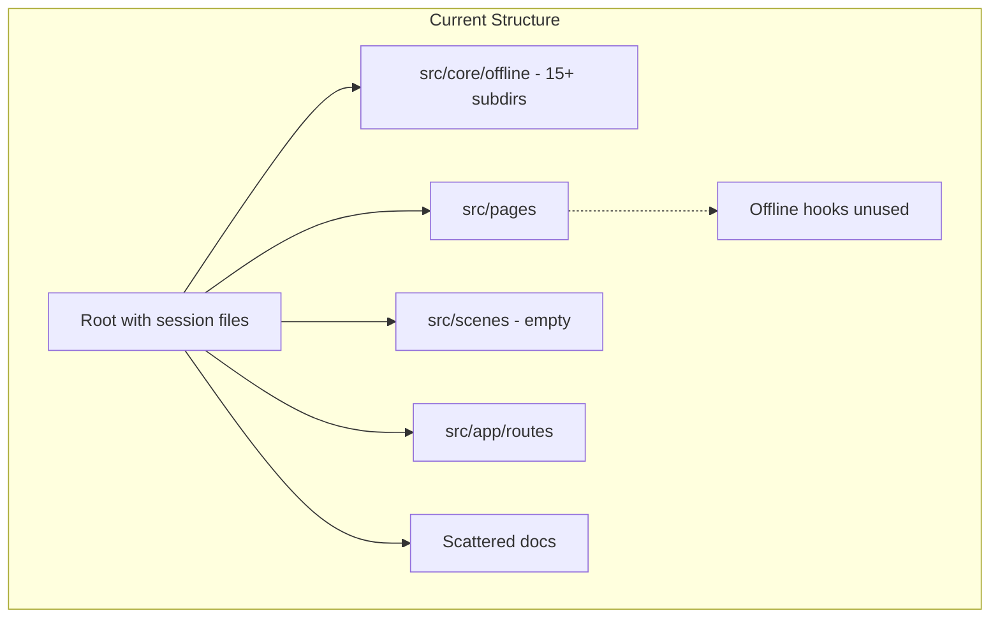
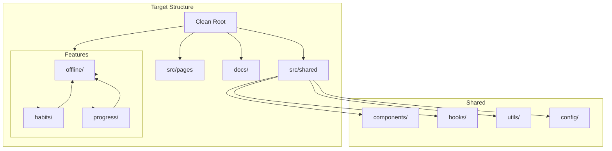

# Design Document

## Overview

The codebase cleanup and simplification project will transform Track N' Stick
from its current organically-grown structure into a well-organized,
maintainable, and developer-friendly codebase. The design focuses on reducing
cognitive load through intuitive organization, clear separation of concerns, and
comprehensive documentation while maintaining full backward compatibility.

The refactoring will follow a phased approach, allowing incremental improvements
without disrupting ongoing development. Each phase will be self-contained and
reversible, ensuring safe rollout and the ability to pause or adjust based on
team feedback and production metrics.

## Architecture

### Current State



### Target State



## Components and Interfaces

### Directory Structure

#### Root Level Organization

```
tracknstick.com/
├── src/                    # Application source
├── docs/                   # Documentation
├── public/                 # Static assets
├── scripts/               # Build and utility scripts
├── tests/                 # E2E and integration tests
├── .github/               # GitHub workflows
├── package.json
├── README.md
└── [config files]
```

#### Source Organization

```
src/
├── app/                   # Application setup
│   ├── providers/        # React providers
│   └── router/          # Route configuration
├── pages/               # Route pages
│   ├── DashboardPage/
│   ├── HabitsPage/
│   └── ProgressPage/
├── features/            # Feature modules
│   ├── habits/
│   │   ├── components/
│   │   ├── hooks/
│   │   ├── api/
│   │   ├── types.ts
│   │   └── index.ts
│   ├── offline/         # Relocated from core
│   │   ├── components/
│   │   ├── services/
│   │   ├── hooks/
│   │   ├── types.ts
│   │   └── index.ts
│   └── progress/
├── shared/              # Shared resources
│   ├── components/
│   │   ├── ui/         # Base UI components
│   │   └── layouts/    # Layout components
│   ├── hooks/          # Shared hooks
│   ├── utils/          # Utility functions
│   └── config/         # Configuration
├── api/                # API layer
└── assets/             # Images, fonts, etc.
```

### Developer Tooling

#### DevTools Module

```typescript
// src/shared/utils/devtools.ts
interface DevTools {
  // Database operations
  clearDatabase(): Promise<void>;
  exportDatabase(): Promise<DatabaseExport>;
  importDatabase(data: DatabaseExport): Promise<void>;
  inspectDatabase(): Promise<DatabaseStats>;

  // Offline simulation
  simulateOffline(): void;
  simulateOnline(): void;
  simulateSlowNetwork(latency: number): void;

  // Debug helpers
  logSyncQueue(): Promise<void>;
  forceSync(): Promise<void>;
  clearSyncQueue(): Promise<void>;

  // Feature flags
  getFeatureFlags(): FeatureFlags;
  setFeatureFlag(key: string, value: boolean): void;
  resetFeatureFlags(): void;
}
```

#### Configuration System

```typescript
// src/shared/config/constants.ts
export const SYNC_CONFIG = {
  RETRY_ATTEMPTS: 3,
  RETRY_DELAY_MS: 1000,
  BATCH_SIZE: 10,
  SYNC_INTERVAL_MS: 300000, // 5 minutes
} as const;

export const DB_CONFIG = {
  NAME: 'TrackNStickDB',
  VERSION: 1,
  STORES: {
    HABITS: 'habits',
    ENTRIES: 'habitEntries',
    SYNC_QUEUE: 'syncQueue',
  },
} as const;

export const UI_CONFIG = {
  ANIMATION_DURATION_MS: 200,
  DEBOUNCE_DELAY_MS: 300,
  TOAST_DURATION_MS: 3000,
} as const;
```

### Documentation Strategy

#### Documentation Structure

```
docs/
├── README.md                      # Documentation index
├── DEVELOPER_GUIDE.md            # Getting started guide
├── ARCHITECTURE.md               # System architecture
├── API_REFERENCE.md              # API documentation
├── TESTING_GUIDE.md              # Testing strategies
├── DEPLOYMENT.md                 # Deployment procedures
├── adr/                          # Architecture Decision Records
│   ├── 001-offline-first.md
│   ├── 002-indexeddb.md
│   └── 003-directory-structure.md
├── guides/                       # How-to guides
│   ├── adding-features.md
│   ├── debugging.md
│   └── performance.md
└── archive/                      # Old documentation
    ├── sessions/                 # AI session logs
    └── old-implementations/      # Previous iterations
```

#### Component Documentation Template

````typescript
/**
 * HabitCard - Displays a single habit with completion status
 *
 * @component
 * @example
 * ```tsx
 * <HabitCard
 *   habit={habit}
 *   onToggle={handleToggle}
 *   isLoading={false}
 * />
 * ```
 *
 * @param {HabitCardProps} props - Component props
 * @param {Habit} props.habit - Habit data to display
 * @param {Function} props.onToggle - Completion toggle handler
 * @param {boolean} [props.isLoading] - Loading state
 *
 * @returns {JSX.Element} Rendered habit card
 *
 * @since 1.0.0
 * @see {@link Habit} - Habit type definition
 * @see {@link useHabits} - Hook for habit management
 */
````

### Testing Organization

#### Test Structure

```
src/features/habits/
├── components/
│   ├── HabitCard.tsx
│   └── HabitCard.test.tsx      # Unit test
├── hooks/
│   ├── useHabits.ts
│   └── useHabits.test.ts       # Hook test
└── __tests__/
    └── habits.integration.test.ts  # Integration test
```

#### Test Utilities

```typescript
// src/shared/testing/utils.ts
export const TestUtils = {
  // Database mocking
  mockIndexedDB(): void;
  seedDatabase(data: SeedData): Promise<void>;

  // Network mocking
  mockOffline(): void;
  mockOnline(): void;
  mockApiResponse(endpoint: string, response: any): void;

  // Component testing
  renderWithProviders(component: ReactElement): RenderResult;
  waitForLoadingComplete(): Promise<void>;

  // Assertion helpers
  expectSyncQueueEmpty(): Promise<void>;
  expectDataInDatabase(store: string, id: string): Promise<void>;
};
```

### Error Handling

#### Error Boundary System

```typescript
// src/shared/components/ErrorBoundary.tsx
interface ErrorBoundaryProps {
  fallback?: ComponentType<{ error: Error; reset: () => void }>;
  onError?: (error: Error, errorInfo: ErrorInfo) => void;
  isolate?: boolean; // Prevent error propagation
  children: ReactNode;
}

// src/features/offline/components/OfflineErrorBoundary.tsx
export const OfflineErrorBoundary: FC<{ children: ReactNode }> = ({
  children
}) => {
  return (
    <ErrorBoundary
      fallback={OfflineErrorFallback}
      onError={logOfflineError}
      isolate={true}
    >
      {children}
    </ErrorBoundary>
  );
};
```

### Logging System

#### Logger Implementation

```typescript
// src/shared/utils/logger.ts
enum LogLevel {
  DEBUG = 0,
  INFO = 1,
  WARN = 2,
  ERROR = 3,
  NONE = 4,
}

class Logger {
  private level: LogLevel;
  private isDevelopment: boolean;

  constructor() {
    this.isDevelopment = process.env.NODE_ENV === 'development';
    this.level = this.isDevelopment ? LogLevel.DEBUG : LogLevel.ERROR;
  }

  debug(message: string, data?: any): void {
    if (this.level <= LogLevel.DEBUG) {
      console.log(`[DEBUG] ${message}`, data);
    }
  }

  info(message: string, data?: any): void {
    if (this.level <= LogLevel.INFO) {
      console.info(`[INFO] ${message}`, data);
    }
  }

  warn(message: string, data?: any): void {
    if (this.level <= LogLevel.WARN) {
      console.warn(`[WARN] ${message}`, data);
    }
  }

  error(message: string, error?: Error): void {
    if (this.level <= LogLevel.ERROR) {
      console.error(`[ERROR] ${message}`, error);
      // Send to error tracking service in production
      if (!this.isDevelopment && window.Sentry) {
        window.Sentry.captureException(error);
      }
    }
  }
}

export const logger = new Logger();
```

## Deployment Strategy

### Feature Flags

```typescript
// src/shared/config/features.ts
interface FeatureFlags {
  offlineMode: boolean;
  syncIndicator: boolean;
  debugTools: boolean;
  performanceMonitoring: boolean;
}

class FeatureManager {
  private flags: FeatureFlags;

  constructor() {
    this.flags = this.loadFlags();
  }

  isEnabled(feature: keyof FeatureFlags): boolean {
    return this.flags[feature] ?? false;
  }

  enable(feature: keyof FeatureFlags): void {
    this.flags[feature] = true;
    this.persistFlags();
  }

  disable(feature: keyof FeatureFlags): void {
    this.flags[feature] = false;
    this.persistFlags();
  }

  private loadFlags(): FeatureFlags {
    const stored = localStorage.getItem('featureFlags');
    return stored ? JSON.parse(stored) : defaultFlags;
  }

  private persistFlags(): void {
    localStorage.setItem('featureFlags', JSON.stringify(this.flags));
  }
}
```

### Monitoring Integration

```typescript
// src/shared/monitoring/metrics.ts
interface OfflineMetrics {
  syncQueueSize: number;
  syncSuccessRate: number;
  offlineUsageDuration: number;
  conflictResolutionCount: number;
  errorRate: number;
}

class MetricsCollector {
  collect(): OfflineMetrics;
  send(): Promise<void>;
  reset(): void;
}
```

## Migration Plan

### Phase 1: Non-Breaking Cleanup (Week 1)

- Archive session files
- Remove empty directories
- Update documentation
- No code changes required

### Phase 2: Directory Reorganization (Week 2)

- Move offline module to features
- Consolidate types and interfaces
- Update imports via codemod
- Maintain all existing APIs

### Phase 3: Integration (Week 3)

- Switch to offline hooks
- Add error boundaries
- Improve loading states
- Behind feature flag

### Phase 4: Quality and Testing (Week 4)

- Enable TypeScript strict mode
- Add missing tests
- Implement logging system
- Performance optimization

## Success Metrics

```typescript
interface SuccessMetrics {
  // Code Quality
  maxNestingDepth: number; // Target: ≤ 3
  typeErrors: number; // Target: 0
  testCoverage: number; // Target: ≥ 80%

  // Performance
  bundleSize: number; // Target: -20%
  buildTime: number; // Target: ≤ current
  initialLoadTime: number; // Target: ≤ 2s

  // Developer Experience
  onboardingTime: number; // Target: < 1 day
  documentationCoverage: number; // Target: 100%

  // Production
  errorRate: number; // Target: < 0.1%
  offlineSuccessRate: number; // Target: > 99%
}
```
