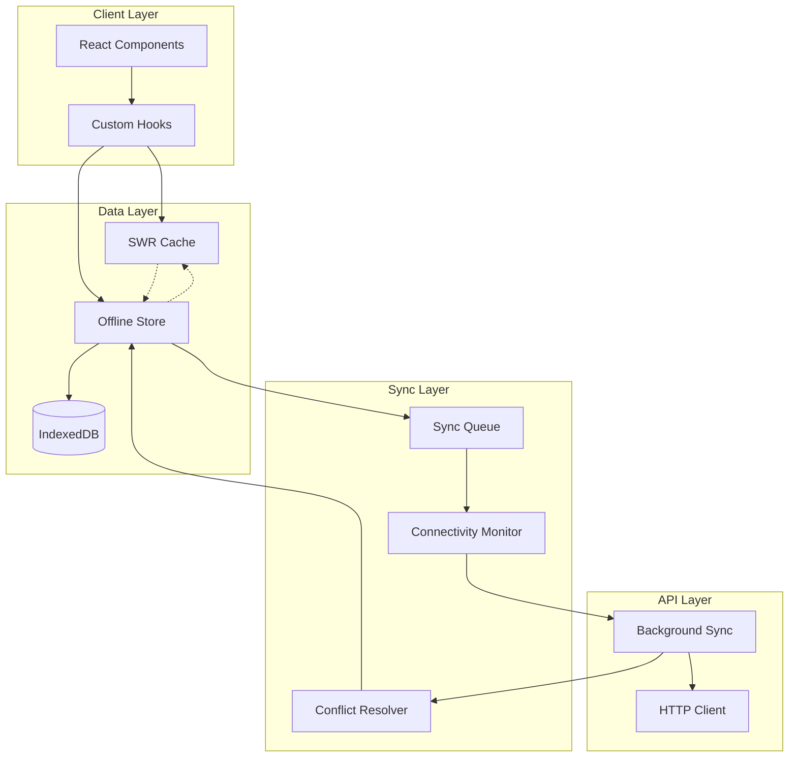

# Design Document

## Overview

The offline-first data management system will transform Track N' Stick from a
cache-first to a true offline-first application. The architecture centers around
IndexedDB as the single source of truth for client-side data, with a
sophisticated synchronization layer that handles conflict resolution and
maintains data consistency across online/offline states.

The system operates on the principle that all data operations happen locally
first, providing immediate user feedback, followed by background synchronization
when connectivity is available. This approach ensures optimal user experience
while maintaining data integrity across all scenarios.

## Architecture



The architecture separates concerns across four main layers:

1. **Client Layer**: React components and custom hooks that provide the
   interface between UI and data operations
2. **Data Layer**: Local data management including SWR cache integration and
   IndexedDB persistence
3. **Sync Layer**: Background synchronization, connectivity monitoring, and
   conflict resolution
4. **API Layer**: HTTP communication and background sync coordination

## Components and Interfaces

### Offline Store (`OfflineStore`)

Central coordinator for all offline operations, implementing the Repository
pattern for data access.

**Key Responsibilities:**

- Coordinate between IndexedDB and sync queue
- Provide unified interface for CRUD operations
- Handle optimistic updates with rollback capability
- Manage temporary ID generation and mapping

**Interface:**

```typescript
interface OfflineStore {
  // Habit operations
  getHabits(date?: Date): Promise<Habit[]>;
  createHabit(habit: CreateHabitData): Promise<Habit>;
  updateHabit(id: string, updates: Partial<Habit>): Promise<Habit>;
  deleteHabit(id: string): Promise<void>;
  toggleHabitCompletion(id: string, date: Date): Promise<void>;

  // Sync operations
  getPendingSync(): Promise<SyncItem[]>;
  markSynced(item: SyncItem): Promise<void>;

  // Status
  isOnline(): boolean;
  getSyncStatus(): SyncStatus;
}
```

### IndexedDB Manager (`IDBManager`)

Low-level IndexedDB operations with transaction management and schema migration
support.

**Database Schema:**

```typescript
interface HabitRecord {
  id: string; // Server ID or temp ID with 'temp_' prefix
  name: string;
  icon: string;
  frequency: Frequency[];
  startDate: string; // ISO string
  endDate?: string; // ISO string
  createdAt: string;
  updatedAt: string;
  deletedAt?: string; // Soft delete timestamp
  syncStatus: 'synced' | 'pending' | 'failed';
}

interface HabitEntryRecord {
  id: string; // Server ID or temp ID
  habitId: string;
  date: string; // ISO date string (YYYY-MM-DD)
  completed: boolean;
  timestamp: string; // ISO timestamp
  createdAt: string;
  updatedAt: string;
  deletedAt?: string;
  syncStatus: 'synced' | 'pending' | 'failed';
}

interface SyncQueueRecord {
  id: string;
  operation: 'create' | 'update' | 'delete' | 'toggle';
  entityType: 'habit' | 'habitEntry';
  entityId: string;
  data: any;
  timestamp: string;
  retryCount: number;
  lastError?: string;
}
```

**Interface:**

```typescript
interface IDBManager {
  // Database lifecycle
  initialize(): Promise<void>;
  migrate(oldVersion: number, newVersion: number): Promise<void>;

  // Transaction management
  transaction<T>(
    stores: string[],
    mode: 'readonly' | 'readwrite',
    operation: (tx: IDBTransaction) => Promise<T>,
  ): Promise<T>;

  // CRUD operations
  get<T>(store: string, key: string): Promise<T | undefined>;
  getAll<T>(store: string, index?: string, query?: IDBKeyRange): Promise<T[]>;
  put<T>(store: string, data: T): Promise<void>;
  delete(store: string, key: string): Promise<void>;
}
```

### Sync Queue (`SyncQueue`)

Manages the queue of operations that need to be synchronized with the server.

**Key Features:**

- Chronological processing with dependency resolution
- Exponential backoff for failed operations
- Batch processing optimization
- Operation deduplication and merging

**Interface:**

```typescript
interface SyncQueue {
  // Queue management
  enqueue(operation: SyncOperation): Promise<void>;
  dequeue(): Promise<SyncOperation | null>;
  peek(): Promise<SyncOperation | null>;
  clear(): Promise<void>;

  // Processing
  processNext(): Promise<SyncResult>;
  processAll(): Promise<SyncResult[]>;

  // Status
  getQueueSize(): Promise<number>;
  getFailedOperations(): Promise<SyncOperation[]>;
}

interface SyncOperation {
  id: string;
  type: 'create' | 'update' | 'delete' | 'toggle';
  entityType: 'habit' | 'habitEntry';
  entityId: string;
  data: any;
  timestamp: Date;
  retryCount: number;
  dependencies?: string[]; // IDs of operations that must succeed first
}
```

### Connectivity Monitor (`ConnectivityMonitor`)

Tracks online/offline status and triggers sync operations when connectivity is
restored.

**Features:**

- Multiple connectivity detection methods
- Debounced status changes to prevent flapping
- Background sync triggers
- Network quality assessment

**Interface:**

```typescript
interface ConnectivityMonitor {
  // Status
  isOnline(): boolean;
  getConnectionType(): ConnectionType;

  // Events
  onStatusChange(callback: (online: boolean) => void): () => void;
  onConnectivityRestored(callback: () => void): () => void;

  // Control
  startMonitoring(): void;
  stopMonitoring(): void;
  forceCheck(): Promise<boolean>;
}
```

### Conflict Resolver (`ConflictResolver`)

Handles conflicts between local and server data during synchronization.

**Resolution Strategies:**

- **Last Write Wins**: Based on `updatedAt` timestamps
- **User Choice**: Present both versions for manual resolution
- **Merge**: For non-conflicting field updates
- **Preserve Both**: For habit entries with same date but different timestamps

**Interface:**

```typescript
interface ConflictResolver {
  resolveHabit(local: Habit, server: Habit): Promise<ConflictResolution>;
  resolveHabitEntry(
    local: HabitEntry,
    server: HabitEntry,
  ): Promise<ConflictResolution>;
  presentUserChoice<T>(
    local: T,
    server: T,
    context: ConflictContext,
  ): Promise<T>;
}

interface ConflictResolution {
  action: 'use_local' | 'use_server' | 'merge' | 'user_choice';
  result?: any;
  requiresUserInput?: boolean;
}
```

## Data Models

### Enhanced Habit Model

```typescript
interface Habit {
  id: string; // Server ID or temp ID (temp_uuid)
  name: string;
  icon: keyof typeof HabitsIcons;
  frequency: Frequency[];
  startDate: Date;
  endDate?: Date;
  completed: boolean; // For current date

  // Offline-first metadata
  createdAt: Date;
  updatedAt: Date;
  syncStatus: SyncStatus;
  isTemporary: boolean; // True if ID starts with 'temp_'
}

interface HabitEntry {
  id: string;
  habitId: string;
  date: string; // YYYY-MM-DD format
  completed: boolean;
  timestamp: Date; // When the entry was recorded
  createdAt: Date;
  updatedAt: Date;
  syncStatus: SyncStatus;
}
```

### Sync Metadata

```typescript
interface SyncStatus {
  status: 'synced' | 'pending' | 'syncing' | 'failed' | 'conflict';
  lastSyncAttempt?: Date;
  lastSuccessfulSync?: Date;
  error?: string;
  retryCount: number;
}

interface SyncMetadata {
  queueSize: number;
  lastSyncTime?: Date;
  isOnline: boolean;
  conflictCount: number;
  failedOperations: number;
}
```

## Error Handling

### Categorized Error Types

1. **Network Errors**: Connection failures, timeouts, server unavailability
2. **Data Errors**: Validation failures, constraint violations, malformed data
3. **Storage Errors**: IndexedDB quota exceeded, corruption, access denied
4. **Conflict Errors**: Data conflicts requiring resolution
5. **System Errors**: Unexpected application errors

### Error Recovery Strategies

**Network Errors:**

- Queue operations for later sync
- Provide offline functionality
- Exponential backoff for retries
- Graceful degradation of features requiring connectivity

**Data Errors:**

- Validate data locally before queuing
- Provide clear user feedback for corrections
- Rollback optimistic updates on server rejection

**Storage Errors:**

- Implement storage quota monitoring
- Provide data export/import functionality
- Graceful fallback to memory-only operation

**Conflict Errors:**

- Automatic resolution for simple cases
- User-guided resolution for complex conflicts
- Preserve all data until resolution

## Testing Strategy

### Unit Testing

**OfflineStore Tests:**

- CRUD operations with and without connectivity
- Optimistic updates and rollback scenarios
- Temporary ID generation and mapping
- Data consistency across operations

**IDBManager Tests:**

- Database initialization and migration
- Transaction management and rollback
- Schema evolution and data preservation
- Error handling and recovery

**SyncQueue Tests:**

- Queue operations (enqueue, dequeue, processing)
- Retry logic and exponential backoff
- Operation merging and deduplication
- Dependency resolution

**ConflictResolver Tests:**

- Resolution strategy selection
- Data merging accuracy
- User choice presentation
- Edge case handling

### Integration Testing

**Online/Offline Transitions:**

- Data consistency during connectivity changes
- Sync queue processing on reconnection
- Conflict detection and resolution
- User experience continuity

**Cross-Browser Compatibility:**

- IndexedDB implementation differences
- Storage quota variations
- Performance characteristics

**Data Migration:**

- Schema upgrade scenarios
- Large dataset migrations
- Rollback procedures

### End-to-End Testing

**User Workflows:**

- Complete habit tracking flow offline
- Conflict resolution user experience
- Multi-device synchronization
- Data recovery scenarios

**Performance Testing:**

- Large dataset handling
- Memory usage optimization
- Background sync performance
- Battery impact assessment

## Synchronization Flow

### Initial Sync (First Load)

1. Check connectivity and authenticate user
2. Fetch initial data from server
3. Populate IndexedDB with server data
4. Mark all records as 'synced'
5. Initialize SWR cache from local data

### Ongoing Operations (Online)

1. User performs operation (create/update/delete)
2. Immediately update IndexedDB with 'pending' status
3. Update SWR cache optimistically
4. Queue operation for sync
5. Process sync queue in background
6. Update status to 'synced' on success

### Offline Operations

1. User performs operation while offline
2. Store in IndexedDB with 'pending' status
3. Generate temporary IDs for new entities
4. Queue operation for later sync
5. Provide immediate UI feedback
6. Display offline indicator

### Reconnection Sync

1. Detect connectivity restoration
2. Fetch latest server data
3. Compare with local pending changes
4. Resolve conflicts using configured strategies
5. Process sync queue chronologically
6. Update IDs and statuses
7. Refresh SWR cache with final data

This design ensures robust offline functionality while maintaining data
consistency and providing excellent user experience across all connectivity
scenarios.
